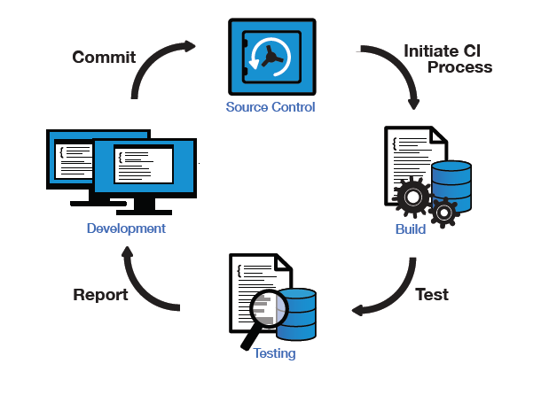
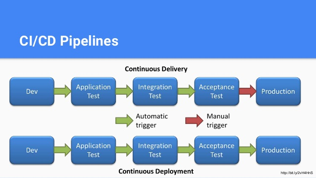

PROJECT LARP
===

## Content

* [Process](#process)
* [Report](#report)
* [HowTo](#howto)
---

## Process

## Report

## HowTo

https://damienfremont.com/2015/01/29/tests-bdd-avec-cucumber-java/

https://damienfremont.com/2015/07/23/how-to-cucumber-java-reuse-same-scenario-for-core-service-and-web-ui-tests/

https://damienfremont.com/2016/05/09/how-to-cucumber-test-report-plugin-2-with-maven-and-java/
